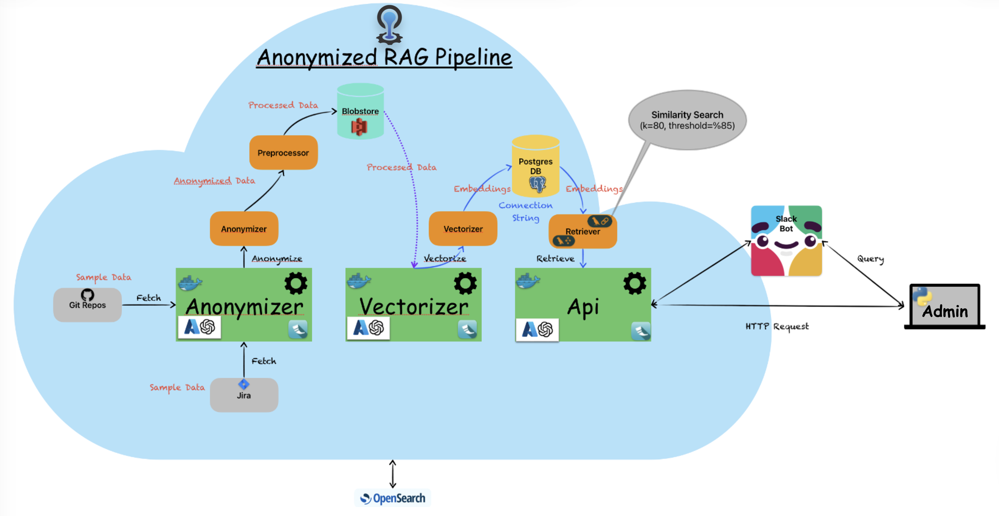
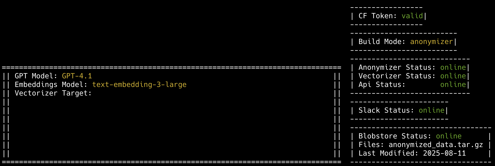

# Multimodal-RAG-Pipeline
The Anonymized Multimodal Retrieval-Augmented Generation (RAG) Pipeline for large-scale internal document processing features an AI-powered chatbot based on GPT-5, designed to assist with any type of documentation. It offers quick and accurate responses to queries related to the documentation provided.

## Abstract

Towards to end of the first quarter of the 21st century the Artificial Intelligence (AI) has emerged as a game changer in the business world. The demand for an intelligent enterprise documentation retrieval system that addresses the critical challenge of accessing information in large-scale software development environments is high, as such a system can significantly improve productivity by locating relevant documents, enhancing knowledge sharing, reducing the time spent searching for information, and accelerating development workflows.

The Agentic RAG pipelines model provides an approach that utilizes three microservice architectures that combine preprocessing (including anonymization, semantic vectorization, and conversational AI) to create a knowledge sharing platform. It is a cloud application that leverages Large Language Models to provide useful features. It can be integrated as a SlackBot to improve accessibility for users. It offers a continuous workflow that updates the database regularly. 

A working prototype has been developed using Flask API's and deployed to Cloud Foundry. Integrates \texttt{SpaCy}-based anonymizer for anonymized data processing, a PostgreSQL vector database for similarity search, and an Azure OpenAI-powered conversational interface with LangGraph orchestration for context-aware responses. The method's versatility accross diverse document types, large languange models and allowing rapid database change hold early promise for robust performance for future applications.

## Architecture:


Developers
------------

If you have question or problems of any kind, do not hesitate to contact to the developer directly:

- Kadir Tastepe <ktastepe@cern.ch>

## Prerequisites
- Python 3.11
- Docker installation
- PostgreSQL database setup
- SAP BTP Global Account
- AWS S3 bucket for blob storage
- SAP AI Core service
- Gen AI Hub Deployments
- Required Python libraries (listed in `requirements.txt`)

## Getting Started

Get the repository
```
git clone https://github.com/kadirtastepe/Multimodal-RAG-Pipeline.git
```

Before start working on this project, ensure that all the required Python libraries and environment are properly set up. Each time you are working on this project, you must set up the software environment first.

1. Go to directory `cd Multimodal-RAG-Pipeline`.
1. First time only authentication `bash setup`.
1. Setup environment `source admin_setup`.
1. Make desired configuration as listed below.
1. To deploy RAG Pipeline on Cloud Foundry, for brevity execute `go`.

## Admin Interface:


| Command | Meaning |
|---------|----------|
| `make all IMAGES=<app>` | Build selected image. [anonymizer/vectorizer/api] |
| `make clean` | Delete all docker images. |
| `make fetch` | Fetch the data to anonymizer. |
| `make anonymize_md` | Anonymize all fetched md files. |
| `make anonymize_json` | Anonymize fetched json data. |
| `make preprocess_md` | Preprocess all fetched md files. |
| `make preprocess_json` | Preprocess fetched json data. |
| `make tar` | Create a tar file including preprocessed data. |
| `make vectorize` | Vectorize the preprocessed data and sends to postgres. |
| `make update` | After fetching the json data process outdated entries. |
| `make chain` | Executes fetch and anonymize together. |
| `make help` | Show all configuration options. |

## Useful Features:

| Command | Options | Meaning |
|---------|---------|----------|
| `set_mode` | `anonymizer/vectorizer/api` | Change build option. |
| `vectorize` | `md/json` `numb_batches` | Change file type and the number of batches for vectorization. |
| `set_config` | `check etc/config.json` | Update the config file in cf apps without redeploying. |
| `set_slack` | `on/off` | Toogle slack communication on/off without redeploying. |
| `s3 ls` |  `  `| Check the files in the blobstore. |
| `s3 delete` | `file_name` | Delete the files in the blobstore. |
| `get_logs` | `  `| Retrieve real-time logs from targeted apps. |


